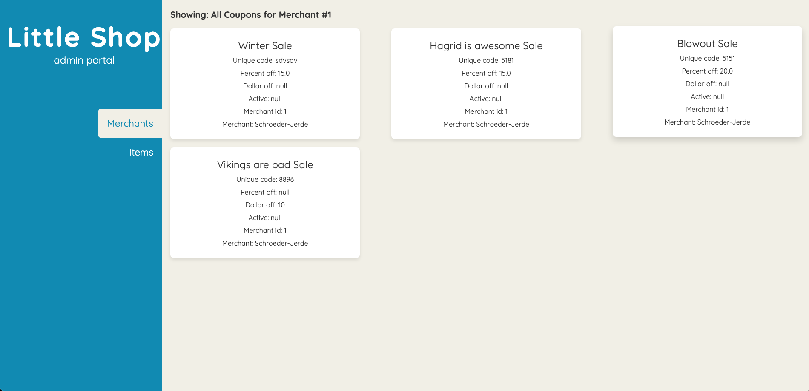

# FE - Little Shop final   

Link to my GitHub.
https://github.com/kevin-newland/little-shop-fe-final-starter-KJN
### Abstract:
In this Front End repository I have added the functionality of displaying the coupons for a given merchant.

### Installation Instructions:
 Fork repo
1. Clone forked repo and rename it `git clone <repo> <new name>` (Do not clone this into your BE repo. See note above.)
1. `cd` into cloned repo
1. Run `npm install`
1. Run `npm run dev` to start developing.
  1. You'll see in the terminal that the project has opened at "http://localhost:5173/"
### Preview of App:

### Context:
For this project as a total(Front End , and Back End) I had 6 days to complete. As most of the project time was spent getting the Back End functional my time on the Front End was limited. As a whole I am proud that I got the Front End functional and working properly.

### Learning Goals:
Display data for users in a frontend application by targeting DOM elements

### Wins + Challenges:

- Challenge: Applying flex wrap to the proper container in order for my coupons page to work properly.
- Win: Figured out how to display the coupons for a given merchant.
- Win: Figured out how to show cdertain things and hide others.